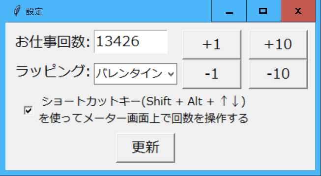

# シイメーター ver3.1.1(tkinter ver)
作成者:はこね(@sii_meter)
## はじめに
しいらちゃん専用お仕事回数カウンター『シイメーター』のGUIアプリが完成しました！
主な機能は
- お仕事回数を表示
- お仕事回数の入力
- イラスト（ラッピング）の変更
- 現在のお仕事回数・日付毎のお仕事回数の保存・グラフ表示

になります。

## ファイル構成
SII-METER ver.XX  
　├ siimeter.exe  
　├ data.json  
　├ data_oshigoto.txt  
　└ [設定ファイルなど]

となっています。  
data.jsonとdata_oshigoto.txtについては後程説明します。
## 機能詳細
siimeter.exeを実行しますと

とメイン画面が表示されます。メイン画面をクリックすると

と設定画面が表示されます。更新ボタンを押すか、×ボタンを押すとメイン画面に戻ります。

**もし画面がぼやけ、上記の写真のように表示されない、異常に画面が大きいときは、exeファイルのプロパティを変更し、高DPIスケールの上書きを行ってください。**

(win10の例)「プロパティ＞互換性タブ＞設定＞高DPI設定の変更＞『高いDPIスケールの動作を上書きします』にチェック＞拡大縮小の実行元はアプリケーションを選択＞OK2回」

設定画面では2つの変数をいじることが出来ます。

### お仕事回数
お仕事回数を変更する方法は3通りです。
- 設定画面の入力ボックスに直接入力する
- 設定画面のボタンで増減する
- ショートカットキー`Shift`+`Alt`+`↑↓`(上下矢印キー)でお仕事回数を±1増減する

ただし、一番下は設定画面のチェックボックスが入っているとき（デフォルト）のみ有効です。

メイン画面の閉じるボタンを押したときに「**本日のお仕事回数をdata_oshigoto.txtに保存しますか？**」というウィンドウが表示されます。**「保存」を押すとお仕事回数がdata_oshigoto.txtに保存されプログラムが終了し、「保存しない」を押すと保存されずにプログラムが終了します。**

### ラッピング
設定画面のラッピングを選択して更新ボタンを押すとしいらちゃんのイラストが変わります。


## data_oshigoto.txt

data_oshigoto.txtには日付毎のお仕事回数が記録されます。**その日最後に保存したお仕事回数が記録されます。**
形式は以下の通りです。Excelなどを使うことでお仕事回数の推移がグラフ表示できると思います。
```
…
2020-08-15 13375
2020-08-16 13376
2020-08-24 13376
2020-08-25 13379
⏎(改行)
```

既にデータをとっているならば、今までの記録を上の形式でdata_oshigoto.txtとしてあらかじめ書いておいてもOKです。その際は**最後の改行を忘れないで下さい。**

シイメーターのバージョンを更新された時も、この**data_oshigoto.txtのみ**をコピーしてください。

現状大丈夫ですが、お仕事回数のデータが消えるようなバグが潜んでる可能性がなくはないので、定期的なバックアップをお願いいたします。

## data.json
これは設定ファイルです。原則いじらないでください。

## バージョン履歴
- ver.3.1.2 バグ修正（Ctrl+Sでのお仕事回数保存→終了時に『保存しない』を押すと保存が反映されないバグを修正）
- ver.3.1.1 タイトルバー表示の変更, バグ修正, 例外処理
- ver.3.1 解像度の更新、終了時の画面の変更、Ctrl+Sでのお仕事回数保存が可能に
- ver.3.0 github,BOOTHに公開

## ライセンス
This software is released under the MIT License, see LICENSE.txt.

