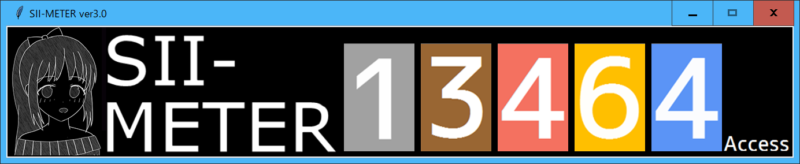

# シイメーター ver3.0(tkinter ver)
作成者:はこね(@sii_meter)
## はじめに
しいらちゃん専用お仕事回数カウンター『シイメーター』のGUIアプリが完成しました！
主な機能は
- お仕事回数を表示
- お仕事回数の入力
- イラスト（ラッピング）の変更
- 現在のお仕事回数・日付毎のお仕事回数の保存・グラフ表示

になります。

## ファイル構成
SII-METER ver.XX  
　├ siimeter.exe  
　├ data.json  
　├ data_oshigoto.txt  
　└ [設定ファイルなど]

となっています。  
data.jsonとdata_oshigoto.txtについては後程説明します。
## 機能詳細
siimeter.exeを実行しますと

とメイン画面が表示されます。メイン画面をクリックすると

と設定画面が表示されます。更新ボタンを押すか、×ボタンを押すとメイン画面に戻ります。

設定画面(等)では2つの変数をいじることが出来ます。

### お仕事回数
お仕事回数を変更する方法は3通りです。
- 設定画面の入力ボックスに直接入力する
- 設定画面のボタンで増減する
- ショートカットキー`Shift`+`Alt`+`↑↓`(上下矢印キー)でお仕事回数を±1増減する

ただし，一番下は設定画面のチェックボックスが入っている時（デフォルト）のみ有効です。

メイン画面の閉じるボタンを押したときに「**本日のお仕事回数をdata_oshigoto.txtに保存しますか？**」というウィンドウが表示されます。**「はい」を押すとお仕事回数がdata.jsonとdata_oshigoto.txtに保存されプログラムが終了し、「いいえ」を押すと保存されずにプログラムが終了します。**

### ラッピング
設定画面のラッピングを選択して更新ボタンを押すとしいらちゃんのイラストが変わります。


## data_oshigoto.txt

data_oshigoto.txtには日付毎のお仕事回数が記録されます。**その日最後に保存したお仕事回数が記録されます。**
形式は以下の通りです。Excelなどを使うことでお仕事回数の推移がグラフ表示できると思います。
```
…
2020-08-15 13375
2020-08-16 13376
2020-08-24 13376
2020-08-25 13379
⏎(改行)
```

既にデータをとっているならば、今までの記録を上の形式でdata_oshigoto.txtとしてあらかじめ書いておいてもOKです。その際は**最後の改行を忘れないで下さい。**

現状大丈夫ですが、お仕事回数のデータが消えるようなバグが潜んでる可能性がなくはないので、定期的なバックアップをお願いいたします。


## ライセンス
This software is released under the MIT License, see LICENSE.txt.

