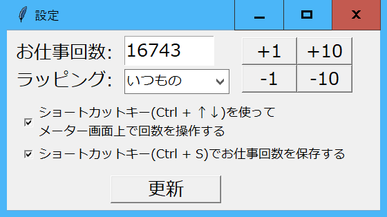

# シイメーター ver3.2(tkinter ver)
作成者:はこね(@sii_meter)
## はじめに
しいらちゃん専用お仕事回数カウンター『シイメーター』がGUIアプリになりました！  
この仕様書をお読みになり、マスターの推しごとにご活用ください。

## 特長
### お仕事回数を表示！
お仕事回数を表示するメイン機能です。**1~99万9999回**まで対応。
### 充実したお仕事回数入力機能！
お仕事回数は直接入力する以外に、ショートカットキーによるカウントアップ等にも対応。
### イラスト（ラッピング）が選べる！
メーターのデザインであるイラストが選べます！随時追加していく予定です。

### 日々のお仕事回数が記録できる！
入力したお仕事回数は日付毎に1つ保存されるので、日々のお仕事回数が記録できます。  
Excelなどを使うことでお仕事回数の推移をグラフ表示できます！

になります。
## インストール方法
### はじめてお使いになる場合
https://sii-en-tai.booth.pm/items/2370383 からダウンロードしたzipファイルを解凍してそのままお使いください。
### バージョンアップする場合・お仕事回数のデータを引き継ぐ場合
解凍したファイルに以前の[data_oshigoto.txt](#dataoshigototxt)を上書きした後、アプリを起動し、現在のお仕事回数を入力して保存してください。
## 機能詳細
siimeter.exeを実行しますと

とメイン画面(メーター画面)が表示されます。メイン画面をクリックすると

と設定画面が表示されます。更新ボタンを押すか、×ボタンを押すとメイン画面に戻ります。

**もし画面がぼやけ、上記の写真のように表示されない、異常に画面が大きいときは、exeファイルのプロパティを変更し、高DPIスケールの上書きを行ってください。**

(win10の例)「プロパティ＞互換性タブ＞設定＞高DPI設定の変更＞『高いDPIスケールの動作を上書きします』にチェック＞拡大縮小の実行元はアプリケーションを選択＞OK2回」

設定画面では2つの変数(ショートカットキー機能の有無)をいじることが出来ます。

### お仕事回数
#### お仕事回数の変更
お仕事回数を変更する方法は3通りです。
- 設定画面の入力ボックスに直接入力する
- 設定画面のボタンで増減する
- ショートカットキー`Ctrl`+`↑↓`(上下矢印キー)でお仕事回数を±1増減する　※ver3.2から

ただし、一番下は設定画面のチェックボックスが入っているとき（デフォルト）のみ有効です。

また、`Ctrl`+`Z`を押すとメーターの回数が**前回保存時の回数**に戻ります。間違えてメーターを進め過ぎた時などにお使いください。
#### お仕事回数の保存
お仕事回数を保存する方法は
- メイン画面でショートカットキー`Ctrl`+`Z`を押す
- メイン画面の閉じるボタンを押し、保存確認ウィンドウが表示されたときに「保存」ボタンを押す

※保存確認ウィンドウはお仕事回数に変更があった場合(タイトルバーに**未保存**と表示がある場合)に表示されます。


いずれもお仕事回数がdata_oshigoto.txtに記録されます。

### ラッピング
設定画面のラッピングを選択して更新ボタンを押すとしいらちゃんのイラストが変わります。

## ファイル構成
SII-METER ver.XX  
　├ siimeter.exe  
　├ data.json  
　├ data_oshigoto.txt  
　└ [設定ファイルなど]

となっています。  
data.jsonとdata_oshigoto.txtについては後程説明します。
### data_oshigoto.txt

data_oshigoto.txtには日付毎のお仕事回数が記録されます。**その日最後に保存したお仕事回数が記録されます。**
形式は以下の通りです。Excelなどを使うことでお仕事回数の推移がグラフ表示できると思います。
```
…
2020-08-15 13375
2020-08-16 13376
2020-08-24 13376
2020-08-25 13379
⏎(改行)
```

既にデータをとっているならば、今までの記録を上の形式でdata_oshigoto.txtとしてあらかじめ書いておいてもOKです。その際は**最後の改行を忘れないで下さい。**

シイメーターのバージョンを更新された時も、この**data_oshigoto.txtのみ**をコピーしてください。

現状大丈夫ですが、お仕事回数のデータが消えるようなバグが潜んでる可能性がなくはないので、定期的なバックアップをお願いいたします。

### data.json
これは設定ファイルです。原則いじらないでください。
お仕事回数（保存した時）とラッピング・ショートカット設定(アプリ終了時)が記録されています。


## Q＆A
### ラッピングの保存機能はないのですか？
お仕事回数と異なり、アプリを閉じたときのラッピング設定が次回起動時に反映されます。
## バージョン履歴
- ver.3.2 保存機能の強化、ラッピングイラスト追加、ショートカットキー変更
- ver.3.1.2 バグ修正（Ctrl+Sでのお仕事回数保存→終了時に『保存しない』を押すと保存が反映されないバグを修正）
- ver.3.1.1 タイトルバー表示の変更, バグ修正, 例外処理
- ver.3.1 解像度の更新、終了時の画面の変更、Ctrl+Sでのお仕事回数保存が可能に
- ver.3.0 github,BOOTHに公開

## ライセンス
This software is released under the MIT License, see LICENSE.txt.

